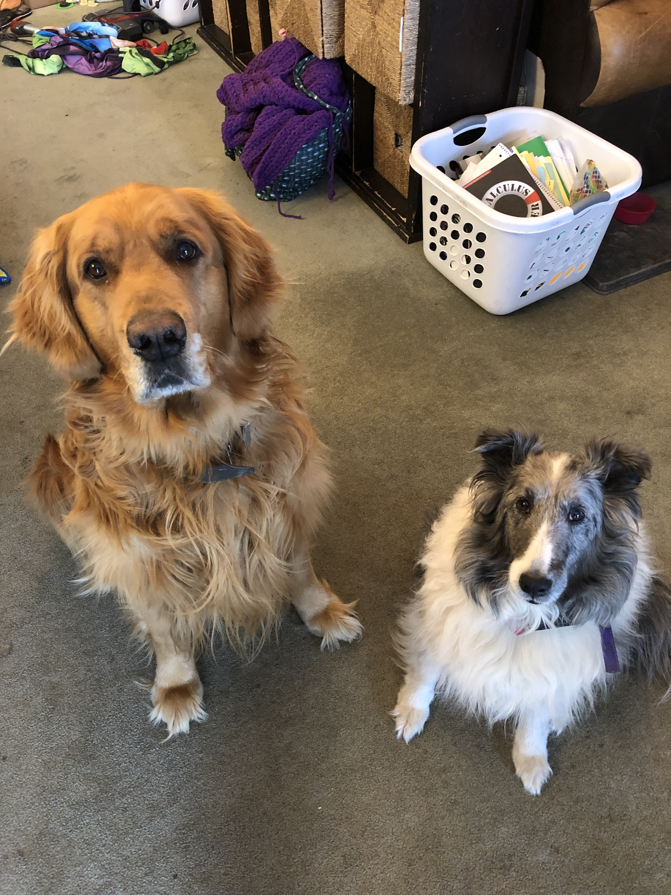

```{r setup, include=FALSE}
knitr::opts_chunk$set(echo = TRUE)
```

<body>

<div style = "text-align: center;">
```{r, out.width = "400px",echo=FALSE}
knitr::include_graphics("./IMG_2824_Original.jpg")
```
  <h3><strong>UVU Bioinformatics Student</strong></h3>
  <h4>Preferred Pronouns: She/Her<h4>
  <h4><a href = https://m-ohran.github.io/about-me/CV.pdf>Current CV</h4></a>
</div>

<br>

#### I am a senior at Utah Valley University, studying Bioinformatics. I'm particularly interested in genomics, and plan to pursue a PhD in the subject after I graduate next spring. I grew up in Orem, Utah, about 5 minutes away from UVU. I attended an early college high school, and in 2015 I graduated with both my high school diploma and an Associate of Science. I started at UVU that fall, and it ended up taking me longer than I would have liked to find my niche. I started out in Percussion Performance, and then switched to Biology, however when the Bioinformatics major was introduced in Fall 2021 I knew I had found my place. About the time I made the switch to Bioinformatics, I got involved in undergraduate research and discovered I really enjoy it. Information about my research can be found [here](https://m-ohran.github.io/research).

<br>

### **Interests**

<br>

##### When I'm not working on school or research projects, I try to find time for fun things, like:
##### Reading: Mostly science fiction and fantasy, but I'm always open to recommendations!
##### Playing music: I'm a percussionist and pianist.
##### Listening to music: I've found artists and songs to enjoy in just about every genre.
##### Drawing: Some examples of my artwork can be found on my [Instagram](https://www.instagram.com/dragonrider109/)
##### Hanging out with my dogs, Brego and Shadowfax.

<div style= "float:center;position: relative;top:10px">
```{r, out.width = "250px",echo=FALSE}

```
</div>

</body>

</div>

<br>
