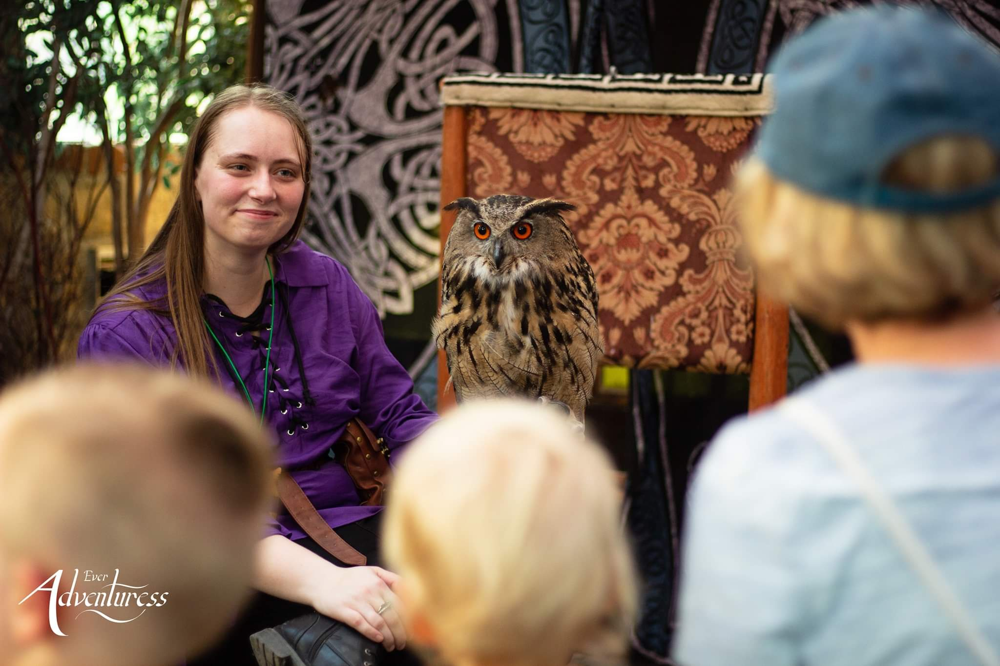

```{r setup, include=FALSE}
knitr::opts_chunk$set(echo = TRUE)
```


## **Marissa Ohran**

<body>

<div style= "float:left;position: relative;top:10px;padding: 10px;">
```{r, out.width = "450px",echo=FALSE}

```
  <h6>Photo: <a href = https://www.facebook.com/everadventuress/>Ever Adventuress</a><h6>
</div>

<div style = "padding: 20px;">

  <h4>I'm a senior at Utah Valley University, majoring in Bioinformatics with a minor in Biology. I plan to pursue a PhD in genomics after I graduate in the spring. I am currently doing research in the <a href = https://cehjelmen.github.io/index.html>Hjelmen Lab</a> at UVU. Information on research projects I have been involved in can be found <a href = https://m-ohran.github.io/research>here</a>.</h4>

</div>

<br><br><br><br><br><br><br><br><br><br><br><br><br>

</body>

</div>
