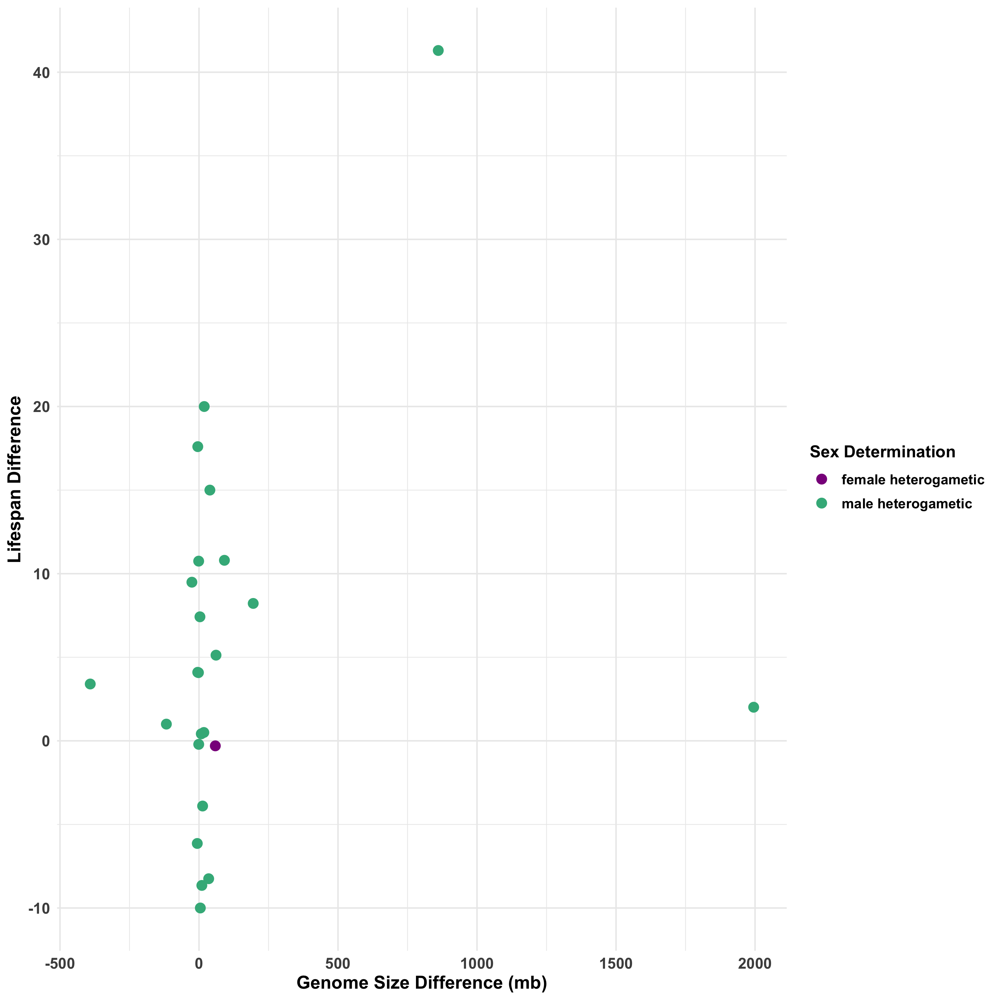
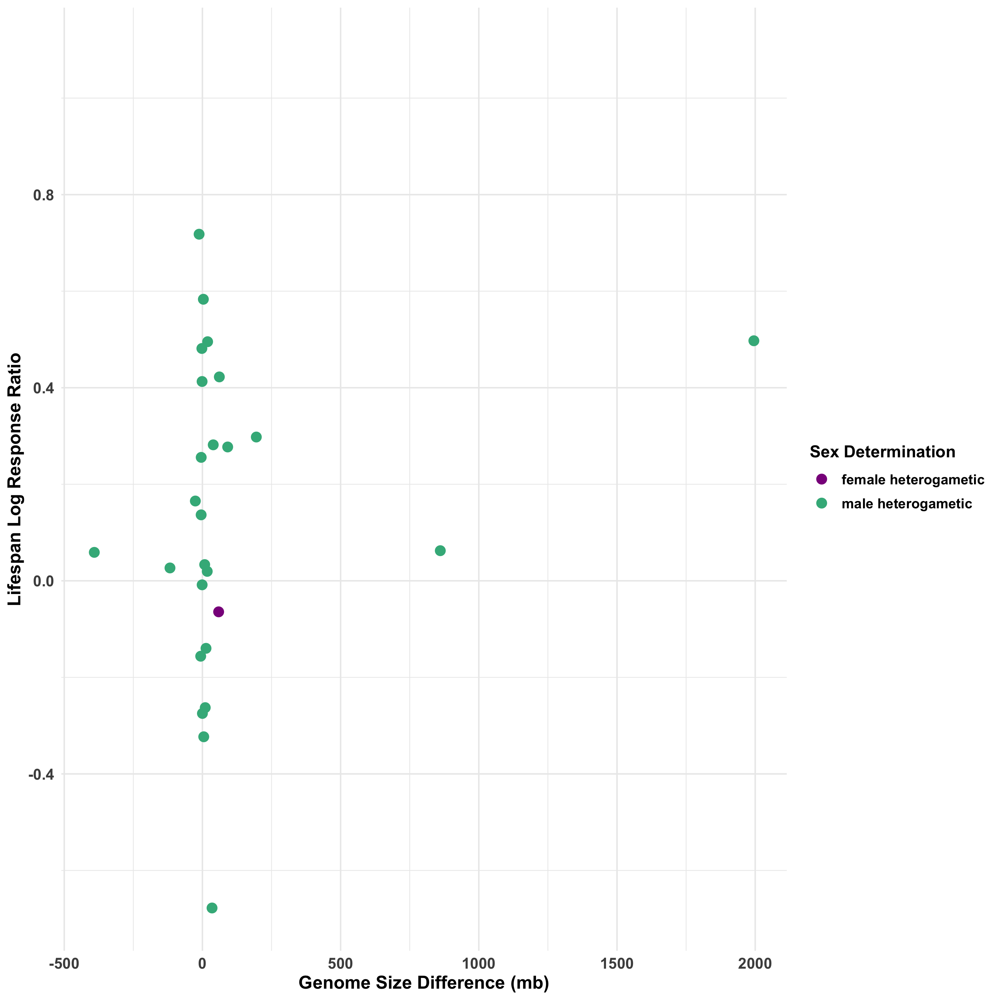

```{r setup, include=FALSE}
knitr::opts_chunk$set(echo = TRUE)
```

<body>

### **Does the difference in sex chromosome size between homogametic and heterogametic individuals in a species contribute to the difference in lifespan between those individuals?**

<br>

##### This is a follow-up study to a study done on lifespan difference in homogametic and heterogametic individuals across the kingdom Animalia. Xircostas et. al (2020) found that individuals of the heterogametic sex, or the sex with the reduced sex chromosome, live shorter lives than their homogametic counterparts. We wanted to know if the size difference between sex chromosomes has any correlation with the difference in lifespan. 

<br>

##### Rather than tracking down measurements for the individual chromosomes, we gathered data on the size of entire genomes from [genomesize.com](genomesize.com) for the species studied. *Drosophila* genome sizes came from work Dr. Hjelmen had previously done, and longevity data for those species came from studies done by Schnebel and Grossfield (1983) and Ma et. al (2018). Genome size and lifespan differences were calculated by subtracting the heterogametic values from the homogametic values.

<br>

##### Here's a glimpse at the data:
```{r echo=FALSE, message=FALSE, warning=FALSE}
library(tidyverse)
read_csv("./Data/Clean/clean_sex_chromosome_data.csv") %>% glimpse
```

<br>

##### I started by plotting the genome size differences against the lifespan differences. There doesn't seem to be any obvious correlation.

```{r, out.width = "700px",echo=FALSE}

```

<br>

##### I next plotted the genome size difference against the lifespan log response ratio. The lifespans of the different species are in different units (days, months, years), so to correct for this Xircostas et. al (2020) calculated the log response ratio by taking the natural log of the homogametic lifespan divided by the heterogametic lifespan. It doesn't really look like there's any correlation here either, although the two plots appear to be very similar.

```{r, out.width = "700px",echo=FALSE}

```

<br>

##### I put together a couple of models to see if there was any statistical significance. There was not.

###### Genome Size Difference and Lifespan Difference
```{r echo=FALSE, message=FALSE, warning=FALSE}
read_lines("Output/Stats/mod1.txt")

```

<br>

###### Genome Size Difference and Lifespan Log Response Ratio
```{r echo=FALSE, message=FALSE, warning=FALSE}
read_lines("Output/Stats/mod2.txt")

```

<br>

##### Looking at the plots and the models, there doesn't appear to be any significant relationship in the lifespan difference and the sex chromosome size difference.

<br>

##### References:

Ma, S., Avanesov, A. S., Porter, E., Lee, B. C., Mariotti, M., Zemskaya, N., Guigo, R., Moskalev, A. A., & Gladyshev, V. N. (2018). Comparative transcriptomics across 14 Drosophila species reveals signatures of longevity. Aging Cell, 17(4), e12740. https://doi.org/10.1111/acel.12740

Schnebel, E. M., & Grossfield, J. (1983). A comparison of life span characteristics in Drosophila. Experimental Gerontology, 18(5), 325–337. https://doi.org/10.1016/0531-5565(83)90011-6

Xirocostas, Z. A., Everingham, S. E., & Moles, A. T. (2020). The sex with the reduced sex chromosome dies earlier: A comparison across the tree of life. Biology Letters, 16(3), 20190867. https://doi.org/10.1098/rsbl.2019.0867


<br><br><br><br><br><br><br><br><br>

</body>

</div>

