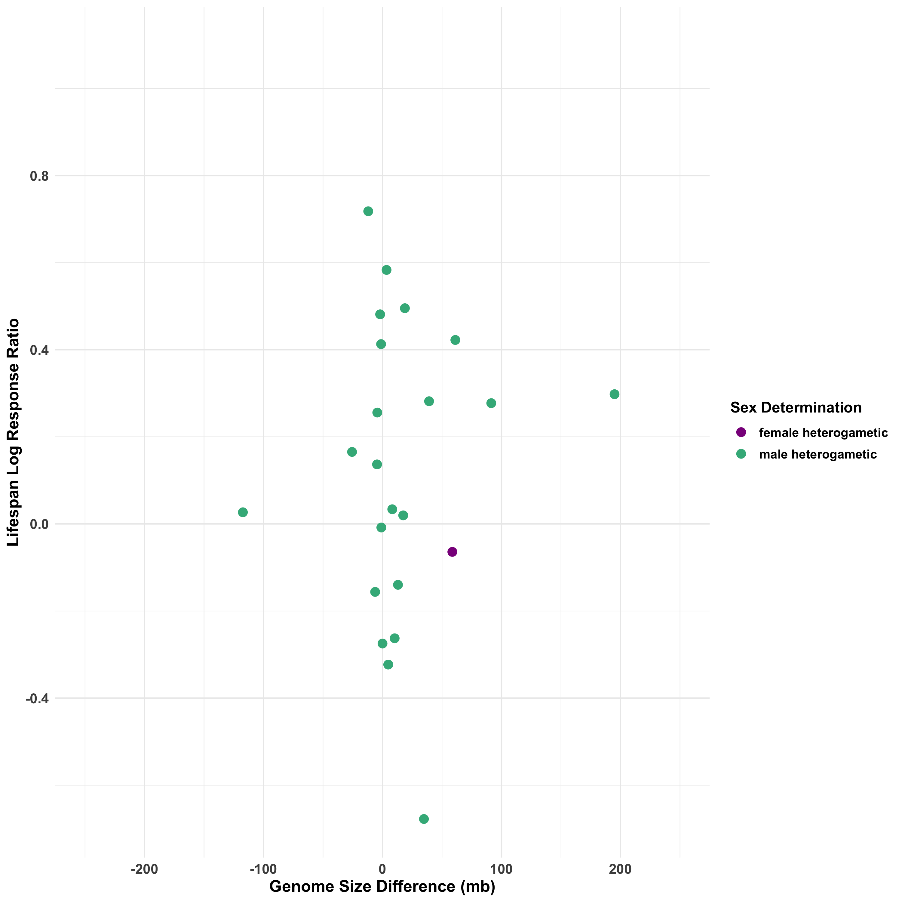

```{r setup, include=FALSE}
knitr::opts_chunk$set(echo = TRUE)
```

<body>

## **Sex Chromosomes & Lifespan**

<br>

##### We are trying to figure out whether or not the difference in sex chromosome size between homogametic and heterogametic individuals in a species contributes to the difference in lifespan between those individuals.

<br>

##### Here's a glimpse at the data we're working with:
```{r echo=FALSE, message=FALSE, warning=FALSE}
library(tidyverse)
read_csv("./Data/Clean/clean_sex_chromosome_data.csv") %>% glimpse
```

<br>

##### Plots:
```{r, out.width = "700px",echo=FALSE}
knitr::include_graphics("./Output/Figs/GS_diff_Lifespan_lrr.png")
```

<br>

```{r, out.width = "700px",echo=FALSE}

```

<br>

##### Models:
```{r}

```

<br>

##### Conclusion:


<br><br><br><br><br><br><br><br><br><br>

</body>

</div>

